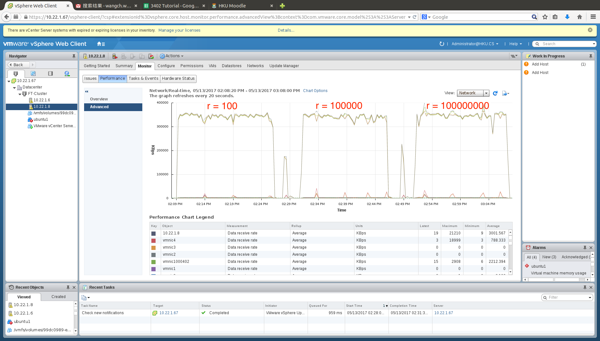
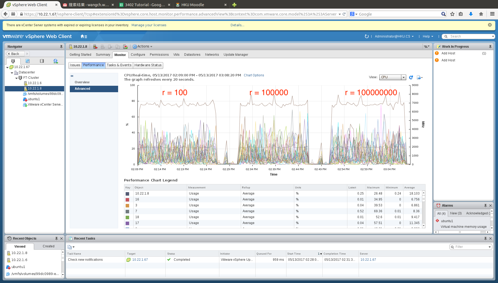
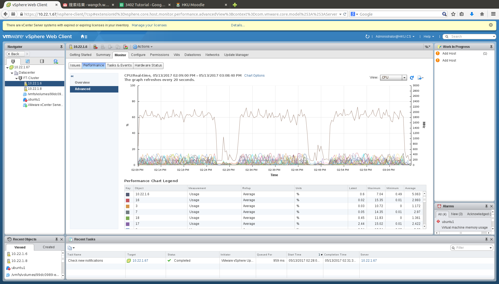

# Plover
Plover is a fault-tolerance system built on top of KVM. In Plover, secondary runs concurrently with the primary and they receive the same total order of network input packets. When Plover detects the server program running in VM becomes idle, a synchronization between primary and secondary is invoked. During a synchronization, the primary only needs to transfer the divergent dirty pages to the secondary.

## Comparison with vSphere FT
Our benchmarking results on the key-value store [SSDB](http://ssdb.io/) of vSphere FT have been approved by VMware.

The goal of our benchmarking is to test the performance of vSphere FT feature under the workloads which would dirty different number of memory pages.

The results show Plover is about 3X faster than vSphere FT on SSDB in variant key range.

### Benchmarking Details
Below are some details of our benchmarking on vSphere 6.5 Fault Tolerance and Plover.

Table 1 shows our performance results of Plover and vSphere running SSDB with different workloads (size of key space).

size of key space | vSphere FT | Plover | unreplicated execution on KVM
------------ | ------------- | ------------- | -------------
-r 100 | 6162.13 req/s | 16875.52 req/s | 23789.89 req/s
-r 100000 | 4734.61 req/s | 15546.15 req/s | 18958.2 req/s
-r 100000000 | 3985.65 req/s | 14935.95 req/s | 18069.56 req/s

Table 2 shows the number of dirty pages for a synchronization and the same rate of dirty pages found in Plover.

size of key space | # of dirty pages | same rate
------------ | ------------- | -------------
-r 100 | 5921 | 80%
-r 100000 | 11203 | 75%
-r 100000000 | 13026 | 74%

The figures below are the bandwidth consumption and CPU usages of running SSDB with different workloads on vSphere hosts.





### Performance Analysis
As you can see from table 1, the throughput of vSphere drops down when size of key space increases. We think this drop comes from the number of dirty pages (verified in table 2) and the saturated bandwidth (bandwidth figure).
On the other hand, since the same rate of dirty pages is very high during a synchronization (table 2), Plover only needs to transfer a very small amount of dirty pages. Therefore, Plover's throughput in table 1 did not go down too much.

We also ran a smaller workload to test vSphere and found the bandwidth consumption of vSphere increases with the size of key space.

## How to setup/test Plover

Tested using Ubuntu 16.04.2 (64bit), MLNX_OFED_LINUX-3.4-2.0.0.0-ubuntu16.04-x86_64

### Test environment prepare
```
# export VMFT_ROOT=<absolute path of vm-ft>
```
- Install MLNX_OFED driver

- RDMA Paxos
```
# install libev libdb libconfig
# cd rdma-paxos/target
# make
```
- Qemu colo
```
# cd qemu
# apt-get install zlib1g-dev libglib2.0-dev libpixman-1-dev libgnutls-dev
# dpkg -i dep-lib/*.deb
# ./configure --disable-werror --target-list=x86_64-softmmu --extra-ldflags="-Wl,--no-as-needed -lnl-3 -lnl-cli-3 -lnl-route-3 -lnl-3 -lnl-cli-3 -lnl-route-3 -L$VMFT_ROOT/rdma-paxos/target -linterpose" --extra-cflags="-I$VMFT_ROOT/rdma-paxos/src/include/rsm-interface -I/usr/include/libnl3"
```

- Set Up the Bridge and network environment

- Qemu-ifup/Qemu-ifdown
```
Primary:
root@master# cat /etc/qemu-ifup
#!/bin/sh
switch=br0
if [ -n "$1" ]; then
         ip link set $1 up
         brctl addif ${switch} $1
fi
root@master# cat /etc/qemu-ifdown
!/bin/sh
switch=br0
if [ -n "$1" ]; then
        brctl delif ${switch} $1
fi
Secondary:
like Primary side
```

### Test steps
**Note: Here the primary side host ip is 10.22.1.2, secondary side host ip is 10.22.1.3.**

- (1) Startup qemu:

- *Primary side:*
```
# LD_LIBRARY_PATH=$VMFT_ROOT/rdma-paxos/target:$LD_LIBRARY_PATH x86_64-softmmu/qemu-system-x86_64 -enable-kvm -boot c -m 2048 -smp 2 -qmp stdio -vnc :7 -name primary -cpu qemu64,+kvmclock -device piix3-usb-uhci \
-drive if=virtio,id=colo-disk0,driver=quorum,read-pattern=fifo,vote-threshold=1,children.0.file.filename=/mnt/sdd/pure_IMG/linux/redhat/rhel_6.5_64_2U_ide,children.0.driver=raw -S \
-netdev tap,id=hn0,vhost=off,script=/etc/qemu-ifup,downscript=/etc/qemu-ifdown -device e1000,id=e0,netdev=hn0,mac=52:a4:00:12:78:66
```

- *Secondary side:*
```
# qemu-img create -f qcow2 /mnt/ramfs/active_disk.img 10G

# qemu-img create -f qcow2 /mnt/ramfs/hidden_disk.img 10G

# LD_LIBRARY_PATH=$VMFT_ROOT/rdma-paxos/target:$LD_LIBRARY_PATH x86_64-softmmu/qemu-system-x86_64 -boot c -m 2048 -smp 2 -qmp stdio -vnc :7 -name secondary -enable-kvm \
-cpu qemu64,+kvmclock -device piix3-usb-uhci -drive if=none,id=colo-disk0,file.filename=/mnt/sdd/pure_IMG/linux/redhat/rhel_6.5_64_2U_ide,driver=raw,node-name=node0 \
-drive if=virtio,id=active-disk0,driver=replication,mode=secondary,file.driver=qcow2,top-id=active-disk0,file.file.filename=/mnt/ramfs/active_disk.img,file.backing.driver=qcow2,file.backing.file.filename=/mnt/ramfs/hidden_disk.img,file.backing.backing=colo-disk0 \
-netdev tap,id=hn0,vhost=off,script=/etc/qemu-ifup,downscript=/etc/qemu-ifdown -device e1000,netdev=hn0,mac=52:a4:00:12:78:66 \
-chardev socket,id=red0,path=/dev/shm/mirror.sock -chardev socket,id=red1,path=/dev/shm/redirector.sock \
-object filter-redirector,id=f1,netdev=hn0,queue=tx,indev=red0 -object filter-redirector,id=f2,netdev=hn0,queue=rx,outdev=red1 -incoming tcp:10.22.1.3:8888 
```
- (2) libnl:
```
# modprobe ifb numifbs=100 # (or some large number)
# ip link set up ifb0 # <= corresponds to tap device 'tap0'
# tc qdisc add dev tap0 ingress
# tc filter add dev tap0 parent ffff: proto ip pref 10 u32 match u32 0 0 action mirred egress redirect dev ifb0
```
- (3) On Secondary VM's QEMU monitor, issue command
```
{'execute':'qmp_capabilities'}
{ 'execute': 'nbd-server-start',
  'arguments': {'addr': {'type': 'inet', 'data': {'host': '10.22.1.3', 'port': '8889'} } }
}
{'execute': 'nbd-server-add', 'arguments': {'device': 'colo-disk0', 'writable': true } }
```
***Note:***

*a. Active disk, hidden disk and nbd target's length should be the same.*

- (4) On Primary VM's QEMU monitor, issue command:
```
{'execute':'qmp_capabilities'}
{ 'execute': 'human-monitor-command',
  'arguments': {'command-line': 'drive_add -n buddy driver=replication,mode=primary,file.driver=nbd,file.host=10.22.1.3,file.port=8889,file.export=colo-disk0,node-name=node0'}}
{ 'execute':'x-blockdev-change', 'arguments':{'parent': 'colo-disk0', 'node': 'node0' } }
{ 'execute': 'migrate-set-capabilities',
      'arguments': {'capabilities': [ {'capability': 'x-colo', 'state': true } ] } }
{ 'execute': 'migrate', 'arguments': {'uri': 'tcp:10.22.1.3:8888' } }
```

- (5) Optionally, enable debug mode
```
{'execute': 'trace-event-set-state', 'arguments': {'name': 'qemu_rdma*', 'enable': true} }
(info trace-events)

{ "execute": "migrate-set-parameters" , "arguments": { "x-checkpoint-delay": 20000 } }
```
